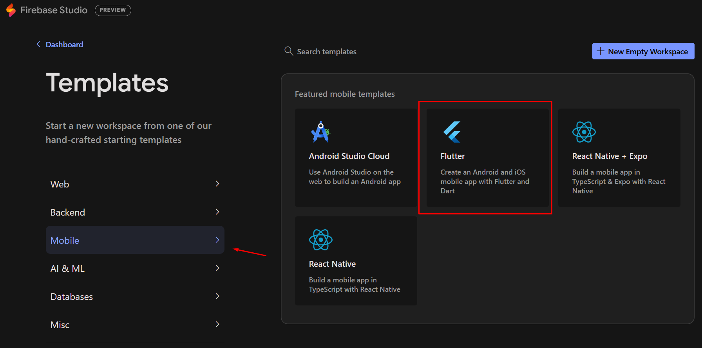
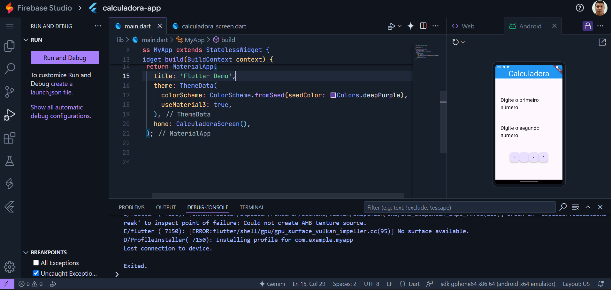

# Calculadora simples em Flutter
Neste repositório, eu programei uma calculadora simples para demonstração em aula aos alunos dos cursos de tecnologia da [Faculdade VINCIT](https://www.faculdadevincit.edu.br/).

O calculadora possui apenas dois campos de texto com quatro botões. Os campos de texto possuem a função de armazenar os valores das operações aritméticas e os quatro botões são referentes às quatro operações aritméticas primitivas (adição, subtração, multiplicação e adição).

Você pode assistir a gravação da aula ao vivo do dia 15/04/2025 clicando na imagem baixo:

[](https://www.youtube.com/watch?app=desktop&v=sm8TUtBTrCI)

## Plataformas utilizadas

Tradicionalmente, você poderá utilizar o ambiente de programação em Flutter, podendo ser instalado em Linux, Windows e macOS, ou então acessando a plataforma do [Firebase Studio](https://idx.google.com/).

### Instalação do ambiente local de desenvolvimento:

Para prosseguir com o ambiente local de desenvolvimento, você deve instalar os seguintes componentes:

- [SDK do Flutter](https://docs.flutter.dev/get-started/install)
- [Visual Studio Code](https://code.visualstudio.com/download)
- [Flutter Extension](https://marketplace.visualstudio.com/items/?itemName=Dart-Code.flutter)
-  [Dart Extension](https://marketplace.visualstudio.com/items/?itemName=Dart-Code.dart-code)
  
Também produzi um vídeo com as orientações a respeito da instalação do ambiente Flutter no microsoft Windows. Você poderá acessá-lo a qualquer momento clicando na imagem a seguir:

[](https://www.youtube.com/watch?app=desktop&v=42jiTBFmeIA)


### Utilização do Firebase Studio

O ambiente de programação do Firebase Studio permite o desenvolvimento de aplicativos online sem a necessidade de nenhum componente ser instalado. Na data em que esse material foi produzido, o Firebase Studio estava em desenvolvimento, e não possuía nenhum custo para ser utilizado. A única limitação é que somente poderia haver 5 projetos por conta.

Para a acessar o Firebase Studio, você deve clicar [neste link](https://idx.google.com/).

Em seguida, para desenvolver o aplicativo, você deve clicar em "New Workspace" e selecionar a opção "Mobile", presente no menu lateral esquerdo. Em seguida, você deve clicar em Flutter.



Por fim, ao clicar no botão, um novo projeto será configurado e você será redirecionado ao ambiente de programação com o VS Code Online:




## Trechos importantes

O app basicamente possui uma única tela, a [calculadora_screen.dart](calculadora_app/lib/calculadora_screen.dart). Nela está estruturado todo o design do app.

**calculadora_screen.dart**
```dart
Widget build(BuildContext context) {
    return Scaffold(
        appBar: AppBar(
          backgroundColor: Colors.blue,
          title: Center(
            child: Text(
              "Calculadora",
              style: TextStyle(fontSize: 45, color: Colors.white),
            ),
          ),
        ),
        body: Padding(
          padding: EdgeInsets.all(30.0),
          child: Column(
            mainAxisAlignment: MainAxisAlignment.center,
            children: [
              Text(
                "Digite o primeiro número:",
                style: TextStyle(fontSize: 30),
              ),
              TextField(
                controller: valor1Controller,
              ),
              SizedBox(
                height: 30,
              ),
              Text(
                "Digite o segundo número:",
                style: TextStyle(fontSize: 30),
              ),
              TextField(
                controller: valor2Controller,
              ),
              SizedBox(
                height: 30,
              ),
              Row(
                mainAxisAlignment: MainAxisAlignment.center,
                children: [
                  FloatingActionButton(
                    onPressed: () {/*Colocar aqui a soma*/},
                    child: Text("+"),
                  ),
                  FloatingActionButton(
                    onPressed: () {/*Colocar aqui a subtração*/},
                    child: Text("-"),
                  ),
                  FloatingActionButton(
                    onPressed: () {/*Colocar aqui a multiplicação*/},
                    child: Text("x"),
                  ),
                  FloatingActionButton(
                    onPressed: () {/*Colocar aqui a divisão*/},
                    child: Text("/"),
                  ),
                ],
              ),
            ],
          ),
        ));
  }
```

**função de soma**
```dart
/*[…] FloatActionButton*/
                onPressed: () {
                      double valor1 = double.parse(valor1Controller.text);
                      double valor2 = double.parse(valor2Controller.text);

                      double resultado = valor1 + valor2;

                      showDialog(
                          context: context,
                          builder: (context) {
                            return AlertDialog(
                              content: Text(
                                resultado.toString(),
                                style: TextStyle(fontSize: 50),
                              ),
                            );
                          });
                    }
/*[…] FloatActionButton*/
```

**função de subtração**
```dart
/*[…] FloatActionButton*/
                onPressed: () {
                      double valor1 = double.parse(valor1Controller.text);
                      double valor2 = double.parse(valor2Controller.text);

                      double resultado = valor1 - valor2;

                      showDialog(
                          context: context,
                          builder: (context) {
                            return AlertDialog(
                              content: Text(
                                resultado.toString(),
                                style: TextStyle(fontSize: 50),
                              ),
                            );
                          });
                    }
/*[…] FloatActionButton*/
```

**função de multiplicação**
```dart
/*[…] FloatActionButton*/
                onPressed: () {
                      double valor1 = double.parse(valor1Controller.text);
                      double valor2 = double.parse(valor2Controller.text);

                      double resultado = valor1 * valor2;

                      showDialog(
                          context: context,
                          builder: (context) {
                            return AlertDialog(
                              content: Text(
                                resultado.toString(),
                                style: TextStyle(fontSize: 50),
                              ),
                            );
                          });
                    }
/*[…] FloatActionButton*/
```

**função de divisão**
```dart
/*[…] FloatActionButton*/
                    onPressed: () {
                      double valor1 = double.parse(valor1Controller.text);
                      double valor2 = double.parse(valor2Controller.text);

                      if (valor2 != 0) {
                        double resultado = valor1 / valor2;

                        showDialog(
                            context: context,
                            builder: (context) {
                              return AlertDialog(
                                content: Text(
                                  resultado.toString(),
                                  style: TextStyle(fontSize: 50),
                                ),
                              );
                            });
                      } else {
                        showDialog(
                            context: context,
                            builder: (context) {
                              return AlertDialog(
                                content: Text(
                                  "Impossível divisão por 0",
                                  style: TextStyle(fontSize: 25),
                                ),
                              );
                            });
                      }
                    }
/*[…] FloatActionButton*/
```
---
Desenvolvido por Alex Rocha.